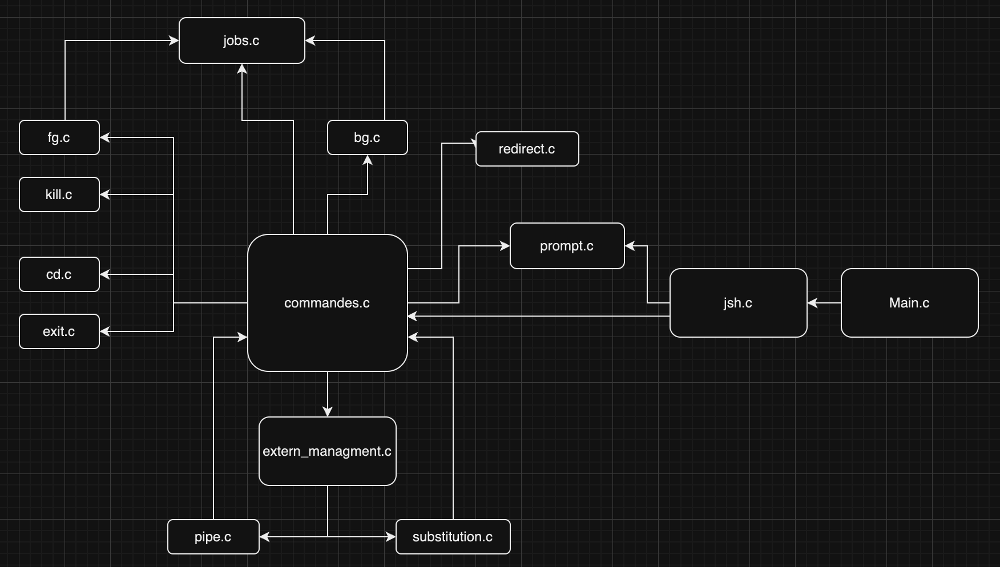
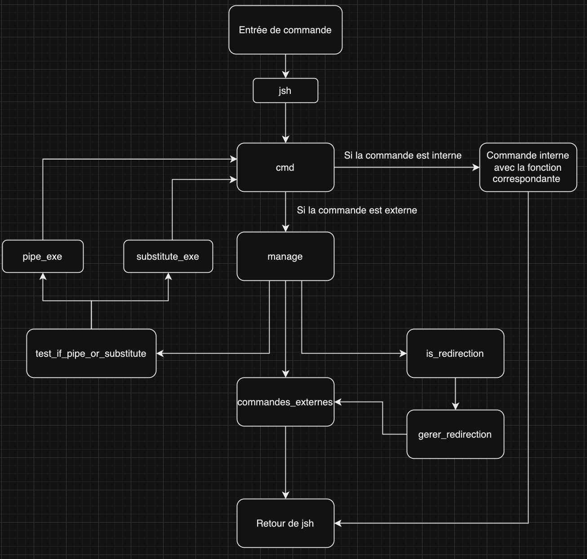

##ARCHITECTURE DES FICHIERS


##GESTION D'UNE COMMANDE


### Gestion des Commandes Externes
- **Fichier Concerné** : `extern_managment.c`
- **Détails d'Implémentation** :
  - `commandes_externes()` utilise `execvp` pour exécuter la commande dans un nouveau processus. Si la processus doit être en arrière plan le processus père n'attend pas la fin de l'execution de son fils pour continuer.

### Gestion des commandes internes
- **Fichiers Concernés** : `cd.c` `bg.c` `fg.c` `exit.c` `kill.c`

###Parsing 
- Pour le parsing des commandes le programme utilise `strtok()` pour les `" "`  mais aussi pour les `"|"`
### Gestion des Signaux
- **Fichiers Concernés** : `jsh.c`, `functions.c`
- **Détails d'Implémentation** : 
  - `jsh.c` utilise `sigaction` pour configurer le comportement du shell en réponse à différents signaux. Par exemple, `SIG_IGN` est utilisé pour ignorer certains signaux.
  - Dans `functions.c` la fonction `commandes_externes()` implémente des handlers visant à gérer le comportement d'un processus à la récéption d'un signal.

### Gestion des Redirections
- **Fichier Concerné** : `redirect.c`
- **Détails d'Implémentation** : 
  - La fonction `gerer_redirection()` fait le necessaire pour mettre en place les fichier de sorties/ d'entrée et le mode de redirection
  - `commandes_externes()` appelle les fonctions qui s'occupent des redirections (entrée et sortie) qui vont modifier la sortie/entrée d'un processus pour qu'elle corresponde au bon fichier.

### Gestion des Pipes
- **Fichier Concerné** : `pipe.c`
- **Détails d'Implémentation** :
  - `pipe_exe()` sépare les commandes entre les `|`. Elle crée ensuite des tubes anonyme et execute chaque commande avec `cmd()` dans un processus different, leurs sorties et entrées standardes sont redirigées vers les tubes adéquats.


### Gestion des Jobs
- **Fichier Concerné** : `jobs.c`
- **Détails d'Implémentation** :
  - Strucutre d'un job :
  ``` 
  typedef struct jobs{
        char *name;
        int num_job;
        char *status;
        pid_t pid;
        int id_group_proc;
    }jobs;
  ```


